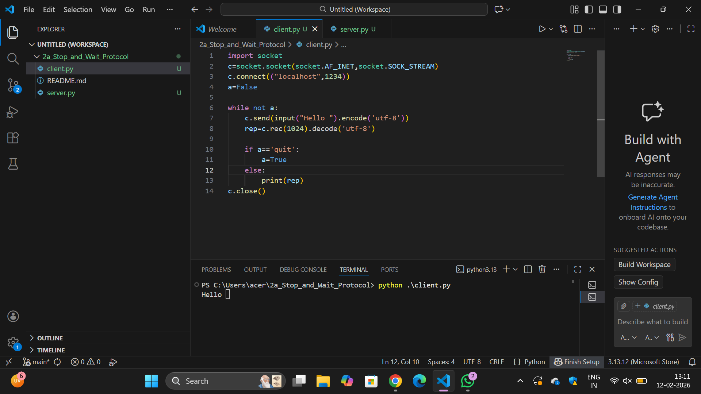

# 2a_Stop_and_Wait_Protocol
## AIM 
To write a python program to perform stop and wait protocol
## ALGORITHM
1. Start the program.
2. Get the frame size from the user
3. To create the frame based on the user request.
4. To send frames to server from the client side.
5. If your frames reach the server it will send ACK signal to client
6. Stop the Program
## PROGRAM
```
client:
import socket
c=socket.socket(socket.AF_INET,socket.SOCK_STREAM)
c.connect(("localhost",1234))
a=False

while not a:
    c.send(input("Hello ").encode('utf-8'))
    rep=c.rec(1024).decode('utf-8')

    if a=='quit':
        a=True
    else:
        print(rep)
c.close()

server:
import socket
from base64 import decode
from operator import truediv

s = socket.socket(socket.AF_INET,socket.SOCK_STREAM)         
s.bind(("localhost", 1234))         
s.listen(5)     
c, addr = s.accept()     
a=False

while not a:
    rep=c.recv(1024).decode('utf-8')
    if rep=='quit':
        a=True
    else:
        print(rep)
    c.send(input("Hello ").encode('utf-8'))

c.close()
s.close()
```
## OUTPUT
client

server

## RESULT
Thus, python program to perform stop and wait protocol was successfully executed.
